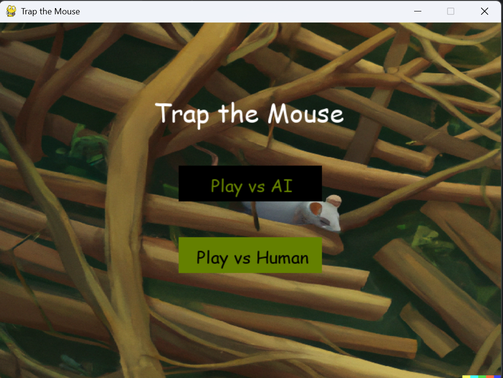
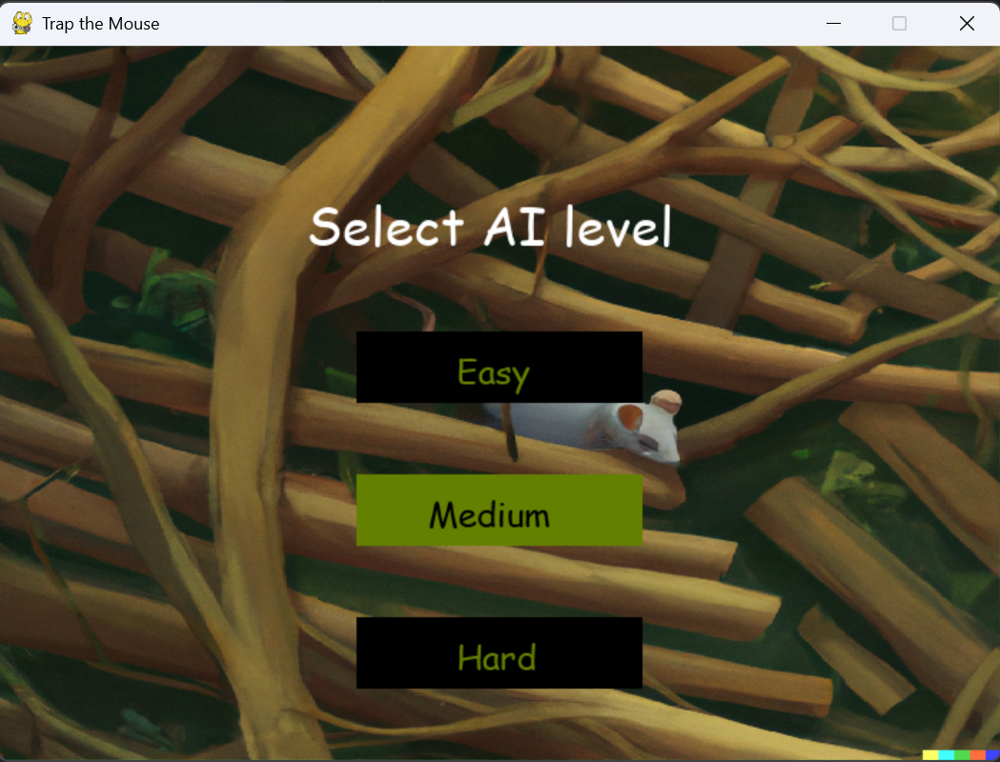
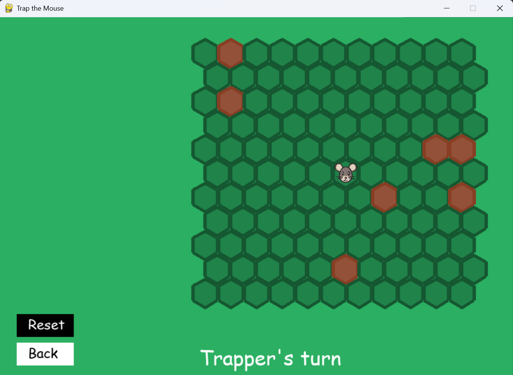

# TrapTheMouse
## Overview
A game where you have to *trap the mouse* in order to win. 
The game starts with the mouse in the middle and a few blocks on the map to help you trap him. 
You can choose to play with a friend on the same laptop or single player. 
In single player, there are 3 levels of difficulty:
* Easy: the mouse makes random moves
* Medium: the mouse makes 70% random moves and 30% best moves (moves to the block that has the minimum distance from the edge calculated using BFS)
* Hard: mouse makes the best moves
## Screenshots
Main menu

AI menu

Game
